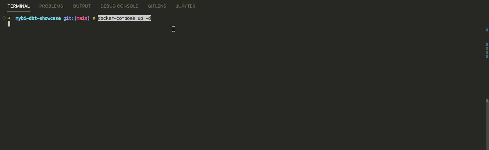
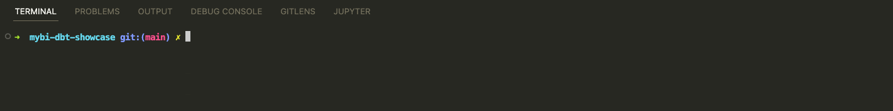
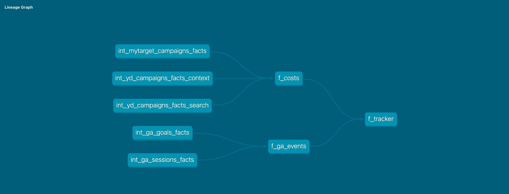
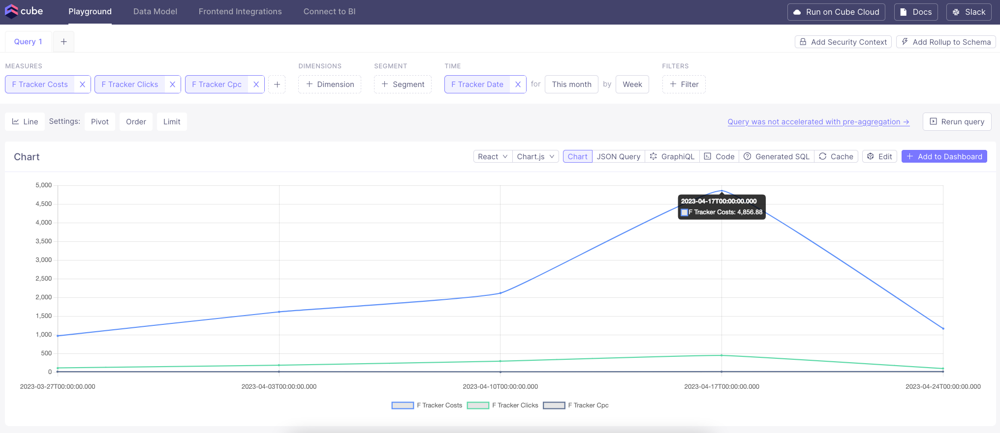
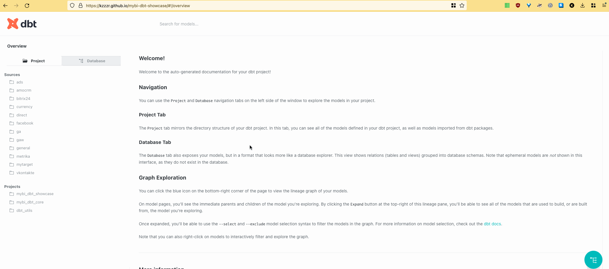

# myBI Market + dbt demo project


This repo guides you through building analyics for [myBI Market](https://market.mybi.ru/) with Modern Data Stack:

- myBI Connect (Extract - Load tool)
- Clickhouse (Database)
- dbt (Transformations) + [mybi-dbt-core](https://github.com/kzzzr/mybi-dbt-core) module
- Metabase (Business Intelligence)
- Github Actions (Continuous Integration + Deployment)

## Table of Contents

1. [Configure environment](#configure-environment)
1. [Install and configure mybi_dbt_core package](#install-and-configure-mybi_dbt_core-package)
1. [Configure data sources](#configure-data-sources)
1. [Build staging layer models](#build-staging-layer-models)
1. [Model Data Marts](#model-data-marts)
1. [Set up metrics layer](#set-up-metrics-layer)
1. [Visualize on a dashboard](#visualize-on-a-dashboard)
1. [Publish dbt project docs](#publish-dbt-project-docs)
1. [Introduce Continuous Integration](#introduce-continuous-integration)

## Configure environment

1. Install prerequisites:
    - IDE (e.g. [VS Code](https://code.visualstudio.com/docs/setup/setup-overview))
    - [Docker](https://docs.docker.com/engine/install/)

2. Fork & Clone this repository and open in IDE

3. Spin up Docker containers

    All the services are configured via [Docker containers](./docker-compose.yml).

    - Clickhouse
    - Metabase
    - Cube

    ```bash
    # launch containers: clickhouse, metabase, cube
    docker-compose build --no-cache
    docker-compose up -d
    ```

4. Open dev container with dbt installed

    ```bash
    devcontainer open .

    # test connections
    dbt --version
    dbt debug
    ```

    

## Install and configure [mybi_dbt_core](https://github.com/kzzzr/mybi-dbt-core) package

1. Install module via [packages.yml](./packages.yml)

    ```bash
    dbt clean # clean temp files
    dbt deps # install dependencies (modules)
    ```

2. ✅ Enable only [relevant data models](./dbt_project.yml#L7-L20) (and disable the rest)

    We will use specific data sources:

    * general – [General]()
    * direct – [Yandex.Direct](https://docs.mybi.ru/yandeks-direkt-struktura-bazovoy-vygruzki/)
    * mytarget – [myTarget](https://docs.mybi.ru/mytarget-struktura-bazovoy-vygruzki/)
    * amocrm – [AmoCRM](https://docs.mybi.ru/amocrm-struktura-bazovoy-vygruzki/)
    * ga – [Google Analytics](https://docs.mybi.ru/google-analytics-struktura-bazovoy-vygruzki/)

    Confirm with command: `dbt ls --resource-type model -s tag:staging`

    

3. ✅ Assign variables

    Certain variable [values have to be set](./dbt_project.yml#L28-L46):
    - source database connection details
    - database and schema name to find mybi source data
    - specific `account_id` values to be included

4. ✅ Turn on custom schema management
    
    I use [generate_schema_name.sql](./macros/generate_schema_name.sql) macro to set target schema names:

    > Renders a schema name given a custom schema name. In production, this macro
    > will render out the overriden schema name for a model. Otherwise, the default
    > schema specified in the active target is used.

    Take a look at [custom_schema_management.sql](https://github.com/kzzzr/mybi-dbt-core/blob/main/macros/custom_schema_management.sql) macro to find out more.
    
## Configure data sources

1. [Create](./macros/init_source_data.sql) Clickhouse database of [PostgreSQL Database Engine](https://clickhouse.com/docs/en/engines/database-engines/postgresql/) with source data:
    
    ```bash
    dbt run-operation init_source_data
    ```

    

## Build staging layer models

Staging models are alredy configured for you in [mybi_dbt_core](https://github.com/kzzzr/mybi-dbt-core) package:
- [source definitions](https://github.com/kzzzr/mybi-dbt-core/blob/main/models/sources/sources.yml)
- [staging models code](https://github.com/kzzzr/mybi-dbt-core/tree/main/models/staging)
- [tests and docs](https://github.com/kzzzr/mybi-dbt-core/blob/main/models/staging/general/general.yml)

All you need to do is just build these models in one command:

```bash
dbt build -s tag:staging
```


## Model Data Marts

With staging models in place we now can proceed to data modeling.

1. Intermediate models include:

    - Wide tables for Google Analytics [goals](./models/intermediate/ga/int_ga_goals_facts.sql) and [sessions](./models/intermediate/ga/int_ga_sessions_facts.sql)
    - Aggregated table for myTarget [campaigns facts](./models/intermediate/mytarget/int_mytarget_campaigns_facts.sql)
    - Aggregated tables for Yandex.Direct [context](./models/intermediate/yd/int_yd_campaigns_facts_context.sql) and [search](./models/intermediate/yd/int_yd_campaigns_facts_search.sql) facts
    - [Comprehensive testing](./models/intermediate/intermediate.yml)

    ```bash
    dbt build -s tag:intermediate
    ```

2. Data Marts include:

    - [Costs](./models/marts/f_costs.sql) (uniting Yandex.Direct + myTarget)
    - [Google Analytics events](./models/marts/f_ga_events.sql) (uniting sessions and goal completions)
    - [Tracker](./models/marts/f_tracker.sql) which combines costs and events in a single table

    ```bash
    dbt build --full-refresh -s tag:marts
    ```

    Take a look at the project graph (DAG):

    

## Set up metrics layer

## dbt Metrics

- Define dbt Metrics in [metrics.yml](./models/metrics/metrics.yml)
- Access dbt Metrics via materalizing in [f_metrics.sql](./models/metrics/f_metrics.sql)

## Cube Metrics

- Define dbt Metrics in [f_tracker.yml](./schema/f_tracker.yml)
- Access dbt Metrics through [Cube playground](http://localhost:4000/#/build?query={%22measures%22:[%22f_tracker.costs%22,%22f_tracker.clicks%22,%22f_tracker.CPC%22],%22order%22:{%22f_tracker.costs%22:%22desc%22},%22dimensions%22:[%22f_tracker.location_country%22],%22timeDimensions%22:[{%22dimension%22:%22f_tracker.date%22,%22granularity%22:%22week%22,%22dateRange%22:%22This%20month%22}]}) or [Metabase](http://localhost:3000/question/13-cubejs-sample-viz)



## Visualize on a dashboard

Now we are ready to visualize key metrics on a dashboard.

I have configured Clickhouse connection and prepared Metabase dashboard which you can access at http://localhost:3000/dashboard/1-mybi-tutorial:
- Email address: `mybi@dbt.tutorial`
- Password: `tutorial101`


You may explore data from Metabase yourself or even build your own dashboard.


## Publish dbt project docs

dbt Docs can be easily served locally on http://localhost:8080:

```bash
dbt docs generate
dbt docs serve
```

Or you may access pre-build version from [Github Pages](https://kzzzr.github.io/mybi-dbt-showcase/#!/overview):



## Introduce Continuous Integration

Let's say you want to introduce some code changes. How do you ensure data quality?

You protect your `main` branch and require Pull Requests to have:
- ✅ [Continuous Integration checks](./.github/workflows/ci.yml) successfully pass
- ✅ Code review from team member of Code Owner


This way you make sure to deploy high quality and functional code.

## Contributing

If you have any questions or comments please create an issue.